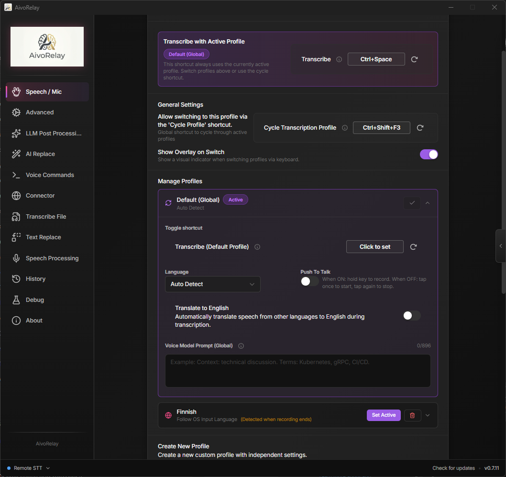
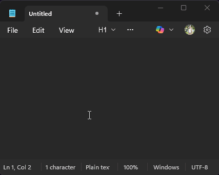
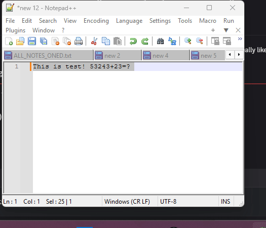
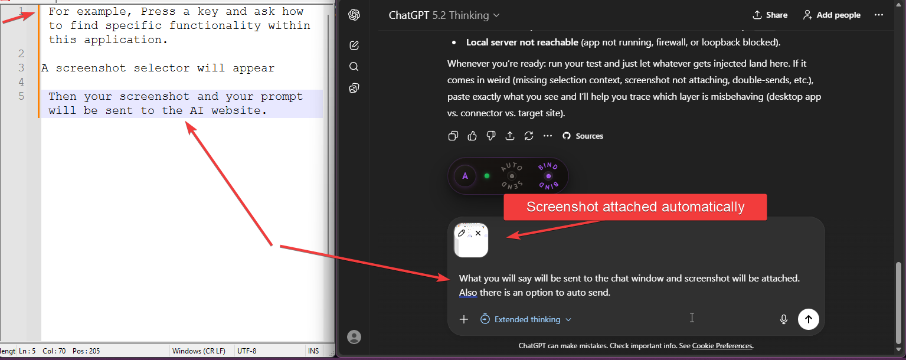

# AivoRelay
[](https://hits.sh/github.com/MaxITService/AIVORelay/)


AI Voice Relay



> 🎙️ AI-powered voice-to-text with smart integrations for Windows  
> A fork of [cjpais/Handy](https://github.com/cjpais/Handy) with additional features

> ## 📥 **[Download AivoRelay](https://github.com/MaxITService/AIVORelay/releases/latest)** — Get the latest release!

> ⚠️ **New in 0.8.5 Beta:** Adds **Live Preview** feature (see your text as it streams). *Note: This version is a beta and has not been tested properly.*

> 🛒 **[Microsoft Store Version](https://apps.microsoft.com/detail/9ppfkfh2zn1l)** — This is an official listing on the Microsoft Store. Note that the Store version is not updated as frequently as the desktop application available here on GitHub, but it does not require administrator rights to install, is signed by Microsoft, and is verified by Microsoft before releasing.

## ✨ Key Features

### 📺 Live Preview (Beta)

See your transcription in real-time in a separate, customizable, always-on-top window.

- **Real-time stream** — View final and interim results as you speak.
- **Customizable** — Adjust opacity, colors, theme, and positioning.
- **Smart Positioning** — Can follow your mouse cursor or stay in a fixed corner.
- **Hotkey Controls** — Assign shortcuts to toggle visibility or trigger actions.

**Setup:** Settings → User Interface → Soniox Live Preview

### 🔴 Soniox Live Transcription

Real-time speech-to-text streaming — see your words appear as you speak!



- **Live streaming** — Words appear instantly during speech
- **Language hints** — Guide recognition with expected languages  

**Setup:** Settings → Advanced → Transcription Provider → Soniox

### 🎚️ Transcription Profiles

Quick-switch between language, prompt, and LLM post-processing presets with dedicated shortcuts: swithc currently active profile or assign each profile its own hotkey!

#### What Are Profiles?

Profiles let you create different transcription configurations and switch between them instantly. Perfect for:

- **Multilingual users** — Switch between English, Russian, Finnish, etc.
- **Different use cases** — One profile for dictation, another for code comments
- **Translation workflows** — Speak in one language, output in another + auto switch language with Windows language!
- **Everything you can imagine!** — Serioulsy, you can invent so many uses!

#### Profile Settings


#### LLM Post-Processing Override

Each profile can override the global LLM post-processing settings:

- **Enable/Disable** — Turn LLM processing on/off per profile
- **Custom Prompt** — Use a different prompt than the global one
- **Custom Model** — Use a different LLM model per profile

**Example:** Create a "Finnish Translation" profile that takes any language input and outputs Finnish text via LLM.

#### The `${output}` Variable

When writing LLM prompts, use `${output}` as a placeholder for the transcribed text:

```
Translate this to Finnish: ${output}
```

**How it works:**

1. You speak → "Hello, how are you?"
2. STT transcribes → "Hello, how are you?"
3. `${output}` is replaced → "Translate this to Finnish: Hello, how are you?"
4. LLM processes → "Hei, mitä kuuluu?"

#### Shortcuts

Assign key combination to following actions:

| Shortcut                        | Action                                           |
| ------------------------------- | ------------------------------------------------ |
| **Main Transcribe**   | Transcribe using the active profile              |
| **Cycle Profile**               | Switch to the next active profile in cycle              |
| **Per-Profile Shortcuts**       | Each profile can have its own dedicated shortcut if you don'w want to cycle profiles but use all at once |


#### Default Profile

The "Default Profile" uses your global settings (Settings → Speech). It cannot be deleted but can be customized or set as active.

**Setup:** Settings → Speech → Transcription Profiles

### 🤖 AI Replace Selection

Voice-controlled text editing — select text, speak instruction, get AI-transformed result.

- Select code → say "add error handling" → improved code replaces selection
- Select paragraph → say "make it shorter" → condensed version
- Empty field + "no selection" mode → say "write a greeting email" → generated text
- Works in any Windows application



In the demonstration above, first I ask to solve the mathematical task, and then to translate text to finish. 

**Setup:** Settings → Advanced → AI Replace Settings

### 📤 Send to ChatGPT/Claude

Voice-to-AI bridge via [AivoRelay Connector](https://github.com/MaxITService/AivoRelay-relay) browser extension.



| Mode                   | Input                  | What ChatGPT receives     |
| ---------------------- | ---------------------- | ------------------------- |
| **Voice only**         | Speak your question    | Your transcribed question |
| **Voice + Selection**  | Speak + selected text  | Question with context     |
| **Voice + Screenshot** | Speak + screen capture | Question with image       |

**Examples:**

- Say "what is recursion" → ChatGPT gets your question
- Select error log, say "why is this failing" → ChatGPT gets question + the log
- Capture chart, say "explain this" → ChatGPT gets question + screenshot

> ⚠️ **Requires:** [AivoRelay Connector](https://github.com/MaxITService/AivoRelay-relay) Chrome extension


### 📁 Transcribe Audio Files

Drag and drop audio files to get a transcript.

- Supports WAV, MP3, OGG, M4A, FLAC
- Outputs Text, SRT (Subtitles), or VTT
- Uses your local or cloud models

**Usage:** Settings → Transcribe Audio File

### ✏️ Text Replacement

Automatically fix transcription errors and apply formatting rules.

| Feature                 | Description                                                          |
| ----------------------- | -------------------------------------------------------------------- |
| **Find & Replace**      | Simple text substitution with special character support (`\n`, `\t`) |
| **Case Insensitive**    | Toggle to match "Hello" and "hello" as the same                      |
| **Regular Expressions** | Advanced pattern matching with capture group support (`$1`, `$2`)    |

**Examples:**

- Fix typos: `teh` → `the`
- Remove repeated words: `\b(\w+)\s+\1\b` → `$1` (regex)
- Add paragraph breaks: `.\n` → `.\n\n`

Applied after LLM post-processing, so you get the final word on the output!

**Setup:** Settings → Text Replace

### 🔠 Smart Decapitalize After Edit

Avoid unwanted capitalization when continuing a sentence after a manual correction.


AivoRelay passively monitors your "edit" key (default: **Backspace**). If you press it to correct a transcription and then resume speaking, the next inserted text chunk will automatically start with a **lowercase** letter. This prevents the system from starting a new "sentence" with a capital letter when you are actually in the middle of a sentence.

- **Non-Blocking** — Uses a passive listener, so your edit keys work exactly as usual.
- **One-Shot Trigger** — The logic fires only once after a correction and then resets.
- **Configurable Timeout** — Set how long the "resume" window remains active after your edit.
- **Real-time Support** — Works seamlessly with Soniox Live transcription and standard modes.

**Setup:** Settings → Text Replace → Decapitalize After Manual Edit

### ☁️ Cloud STT Option

Use Groq, Deepgram, or other OpenAI-compatible APIs — _or_ keep using local Whisper. Your choice!

- No GPU? Use fast cloud APIs
- Have a powerful GPU? Run locally for privacy
- Switch between providers anytime

**Setup:** Settings → Advanced → Transcription Provider

---
### 🗣️ Voice Command Center (Dangerous! Do not use)

Execute PowerShell scripts with your voice. Pre write scriopts... or make LMM write them on the fly (confirmation dialog window appears, you can cancel)

- Say "lock computer" → Locks Windows
- Say "open notepad" → Opens Notepad
- **Somewhat safe:** Always shows confirmation before running
- **Smart:** If no command matches, use AI to generate a script on the fly (e.g. "open chrome and go to youtube")

**Setup:** Settings → Voice Command Center

## 🚀 Quick Start

1. Download from [Releases](https://github.com/MaxITService/AIVORelay/releases)
2. Install and run AivoRelay
3. Press `Ctrl+F8` — hold to record, release to transcribe!

---

## ⚙️ Configuration

### LLM API Relay

**Settings → LLM API Relay**

Configure your LLM provider (OpenAI, Anthropic, etc.) to power AI Replace and Post-Processing features.

### AI Replace Settings

**Settings → AI Replace**

| Setting                        | Description                                                                 |
| ------------------------------ | --------------------------------------------------------------------------- |
| **System Prompt**              | Instructions for the LLM (e.g., "return only transformed text")             |
| **User Prompt Template**       | Template with `${instruction}` (your voice) and `${output}` (selected text) |
| **No Selection System Prompt** | Alternative prompt when no text is selected                                 |
| **Max Characters**             | Limit for selected text (default: 20000)                                    |

### Send Screenshot Settings

**Settings → Browser Connector → Screenshot Settings**

- **Default:** Native selection overlay (no external tools needed)
- **Optional:** Use external tools like ShareX
- Set screenshot folder path (for external tools)
- Enable "Allow Without Voice" for quick image-only sends

### AivoRelay Connector Setup

1. Install [AivoRelay Connector](https://github.com/MaxITService/AivoRelay-relay) Chrome extension
2. Open ChatGPT or Perplexity in a browser tab
3. Click extension icon → "Bind to this tab"
4. Extension connects to `http://127.0.0.1:38243` (configurable)

---

## 📋 Platform Notes

## This extension has only been built and tested for Windows. If you need other platforms, Handy can do it but without additional features.

## 🔧 Original Features

All original Handy features remain available:

- Local Whisper transcription with multiple model sizes
- Voice Activity Detection (VAD)
- Global keyboard shortcuts (two engines: Tauri for performance, rdev for CapsLock/NumLock support — see Debug settings)
- Push-to-talk mode
- LLM post-processing
- Transcription history

---

## 📄 License

MIT License — NO WARRANTIES.

---

## My other projects:

- [OneClickPrompts: Your Quick Prompt Companion for Multiple AI Chats!](https://github.com/MaxITService/OneClickPrompts)
- [Console2Ai: Send PowerShell buffer to AI](https://github.com/MaxITService/Console2Ai)
- [AI for Complete Beginners: Guide to LLMs](https://medium.com/@maxim.fomins/ai-for-complete-beginners-guide-llms-f19c4b8a8a79)
- [Ping-Plotter the PowerShell only Ping Plotting script](https://github.com/MaxITService/Ping-Plotter-PS51)
