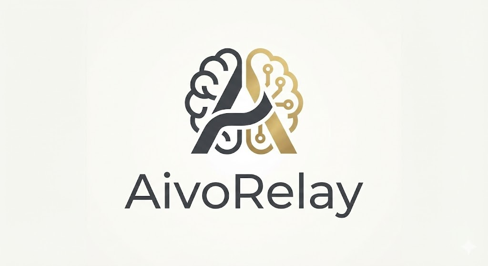
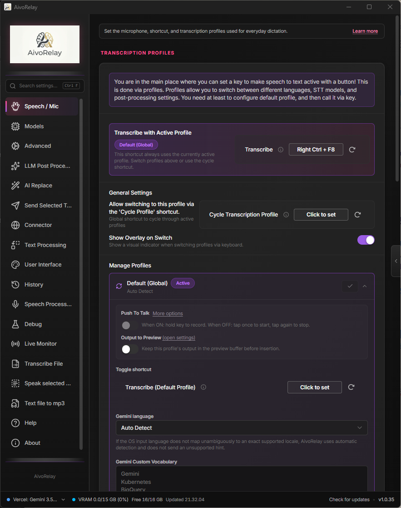
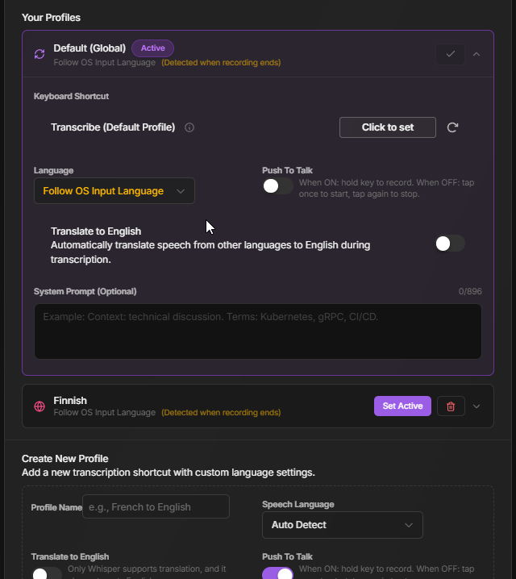
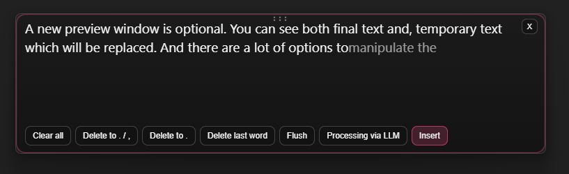
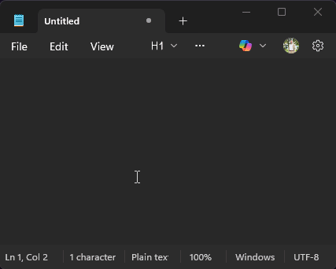
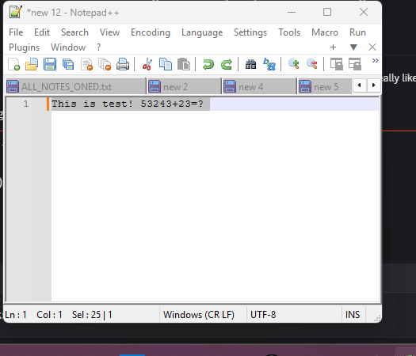
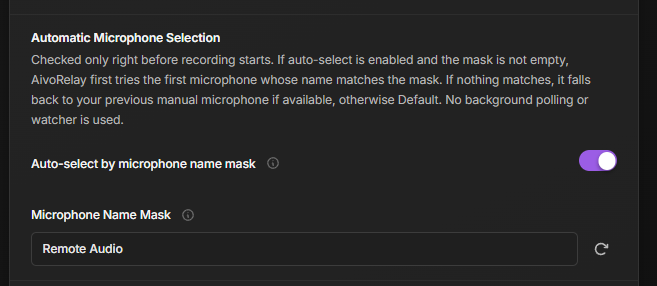
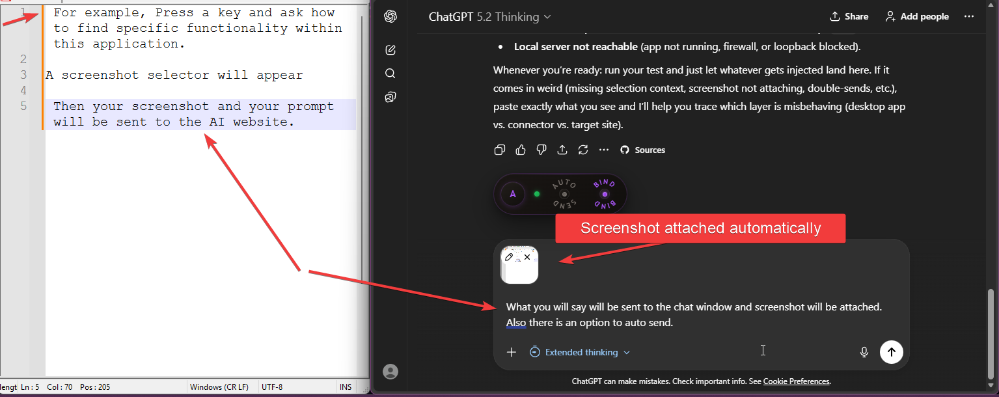
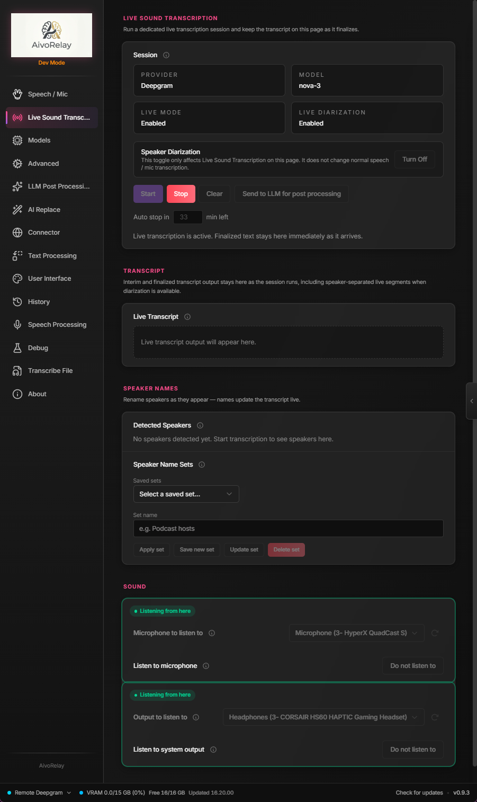
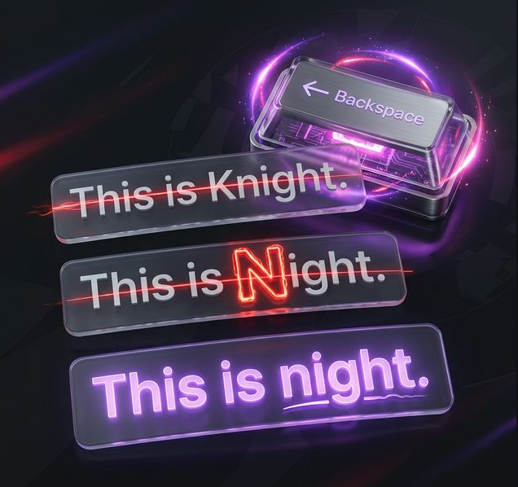

# AivoRelay
Branch tags: #branch/main #branch/release-microsoft-store

[](https://hits.sh/github.com/MaxITService/AIVORelay/)


AI Voice Relay



> 🎙️ AI-powered voice-to-text with smart integrations for Windows  
> A fork of [cjpais/Handy](https://github.com/cjpais/Handy) with additional features

> ## 📥 **[Download AivoRelay](https://github.com/MaxITService/AIVORelay/releases/latest)** — Get the latest release!

> 🛒 **[Microsoft Store Version](https://apps.microsoft.com/detail/9ppfkfh2zn1l)** — This is an official listing on the Microsoft Store. Note that the Store version is **not updated as frequently as the desktop application** available here on GitHub, but it does not require administrator rights to install, is signed by Microsoft, and is verified by Microsoft before releasing.

## ⌨️ File Conversion CLI

AivoRelay exposes the same two app-managed file workflows in the current
terminal:

- [Audio file → text or Markdown](CLI-SPEECH-TO-TEXT.md)
- [Text or Markdown → MP3 or WAV](CLI-TEXT-TO-SPEECH.md)

Provider credentials and detailed conversion behavior remain configured in
the matching app settings pages.

## ✨ Key Features

### Place cursor anywhere, press hotkey, speak, and watch your text appear in place!

Of course, basic speech-to-text, all that upstream can do. Lots of models: cloud, local, languages auto pick up, etc.
If you use local speech-to-text models, then app is local and free. No data goes outside. If you use any cloud models, data goes outside.
Then after speech-to-text model produced text, it can be processed by LLM model (this is handled via API to the server of your choice).
And also there are some other processings that can be made, like replacing any text by regular expression or some minor form of post processing.
Then there are some additional features that you might want to use or not: like relaying your text to the ChatGPT, running commands, making text out of audio files, recording computer audio as text and so on. The app is complex but capable and you can make it simpler by not using some features.


### 🎚️ Transcription Profiles

Quick-switch between language, prompt, and LLM post-processing presets with dedicated shortcuts: switch the currently active profile or assign each profile its own hotkey!

#### What Are Profiles?

Profiles let you create different transcription configurations and switch between them instantly. Perfect for:

- **Multilingual users** — Switch between English, Russian, Finnish, etc.
- **Different use cases** — One profile for dictation, another for code comments
- **Translation workflows** — Speak in one language, output in another + auto switch language with Windows language!
- **Everything you can imagine!** — Seriously, you can invent so many uses!

#### Profile Settings


#### LLM Post-Processing Override

Each profile can override the global LLM post-processing settings:

- **Enable/Disable** — Turn LLM processing on/off per profile
- **Custom Prompt** — Use a different prompt than the global one
- **Custom Model** — Use a different LLM model per profile

**Example:** Create a "Finnish Translation" profile that takes any language input and outputs Finnish text via LLM.
#### The `${output}` Variable

When writing LLM prompts, use `${output}` as a placeholder for the transcribed text:

```
Translate this to Finnish: ${output}
```

**How it works:**

1. You speak → "Hello, how are you?"
2. STT transcribes → "Hello, how are you?"
3. `${output}` is replaced → "Translate this to Finnish: Hello, how are you?"
4. LLM processes → "Hei, mitä kuuluu?"

#### Shortcuts

Assign key combinations to the following actions:

| Shortcut                        | Action                                           |
| ------------------------------- | ------------------------------------------------ |
| **Main Transcribe**   | Transcribe using the active profile              |
| **Cycle Profile**               | Switch to the next active profile in cycle              |
| **Per-Profile Shortcuts**       | Each profile can have its own dedicated shortcut if you don't want to cycle profiles but use all at once |


#### Default Profile

The "Default Profile" uses your global settings (Speech / Mic). It cannot be deleted but can be customized or set as active.

**Setup:** Transcription Profiles


### 🔊 Text to Speech (App can also do that!)

**Read text aloud or turn complete documents into narrated MP3 or WAV files.** AivoRelay can speak clipboard or selected text in most Windows applications and convert `.txt` and `.md` documents to mp3 with cloud, Windows, or optional local voices. Cloud services receive the supplied text and set their own pricing; Windows voices and local models keep synthesis on the device.

You do not need to understand every setting to begin. AivoRelay includes ready-made presets for every TTS provider and automatically opens the recommended preset the first time you select a provider on each TTS page.

#### Speak selected text

1. Open **Speak selected text** in the sidebar.
2. Choose a provider. Its recommended preset is loaded automatically the first time; you can select a different preset later.
3. Add an API key if the selected cloud provider requires one. Windows voices and the unofficial Microsoft Read Aloud integration do not require a key; local models keep synthesis on the device after installation.
4. Assign a keyboard shortcut under **Actions**. Other settings can stay at their defaults.
5. Select text in a supported application and press the shortcut to hear it.

#### Text file to MP3 or WAV

Open **Text file to mp3** in the sidebar to convert one or more `.txt` or `.md` documents, scan folders with optional subfolders, or automate a watched folder. Long documents are split at natural boundaries, and interrupted jobs can resume from saved progress. Optional AI cleanup may send text to the configured LLM and incur provider costs. Existing outputs are never overwritten. The workflow is also available from the [TTS file-conversion CLI](CLI-TEXT-TO-SPEECH.md).

Available choices include Soniox, Deepgram, OpenAI, OpenAI-compatible custom servers, Murf AI (Falcon 2 and Gen2), ElevenLabs (Eleven v3 and Multilingual v2), Cartesia Sonic 3.5, Windows installed voices, the unofficial Microsoft Read Aloud integration, and optional local Qwen or Kokoro models. File conversion and interactive speech keep separate active settings while sharing saved presets.


### 📺 Live Preview (only if you want it)

See your transcription in real-time in a separate, customizable, always-on-top window.

- **Real-time stream** — View final and interim results as you speak.
- **Customizable** — Adjust opacity, colors, theme, and positioning.
- **Smart Positioning** — Can follow your mouse cursor or stay in a fixed corner.
- **Hotkey Controls** — Assign shortcuts to toggle visibility or trigger actions.

**Setup:** User Interface → Live Preview


### 🔴 Soniox Live Transcription

Real-time speech-to-text streaming — see your words appear as you speak!



- **Live streaming** — Words appear instantly during speech
- **Language hints** — Guide recognition with expected languages  

**Setup:** Models

### 🌐 Deepgram Support for live transcription

Use Deepgram for fast cloud transcription, including live speech-to-text.

- **Regular or live use** — Works for standard recording and live transcription
- **Flexible tuning** — Adjust settings for speed and accuracy
- **Speaker diarization** — Can label different speakers in audio file transcription

**Setup:** Models


### 🤖 AI Replace Selection

Voice-controlled text editing — select text, speak instruction, get AI-transformed result.

- Select code → say "add error handling" → improved code replaces selection
- Select paragraph → say "make it shorter" → condensed version
- Empty field + "no selection" mode → say "write a greeting email" → generated text
- Works in any Windows application



In the demonstration above, first I ask to solve the mathematical task, and then to translate text to Finnish.

**Setup:** AI Replace

### 🎙️ Automatic Preferred Microphone Selection

If you frequently connect different headsets, USB microphones, or docking stations, you can give one preferred microphone priority whenever it is available. This is also useful with Windows Remote Desktop, where your redirected microphone may appear under a different name—often **Remote Audio**—instead of the microphone you normally use.

AivoRelay checks the available input devices before every recording, automatically switches to the matching preferred microphone while it is present, and falls back to your last manually selected microphone when it disappears.

Set a case-insensitive microphone name mask such as `Remote Audio` (wildcards `*` and `?` are also supported). The check runs only when recording starts, with no background device polling.



**Setup:** Audio Processing → Automatic Microphone Selection

### 📤 Send to ChatGPT/Claude

Voice-to-AI bridge via [AivoRelay Connector](https://github.com/MaxITService/AivoRelay-relay) browser extension.

- **Easy app-driven setup** — AivoRelay can unpack/export the extension right from the app.
- **Generated password** — The app can create the connector password for you automatically.
- **CORS-ready local bridge** — The local connector flow is configured for secure browser use without extra manual setup.



| Mode                   | Input                  | What ChatGPT receives     |
| ---------------------- | ---------------------- | ------------------------- |
| **Voice only**         | Speak your question    | Your transcribed question |
| **Voice + Selection**  | Speak + selected text  | Question with context     |
| **Voice + Screenshot** | Speak + screen capture | Question with image       |

**Examples:**

- Say "what is recursion" → ChatGPT gets your question
- Select error log, say "why is this failing" → ChatGPT gets question + the log
- Capture chart, say "explain this" → ChatGPT gets question + screenshot

> ⚠️ **Requires:** [AivoRelay Connector](https://github.com/MaxITService/AivoRelay-relay) Chrome extension

### 📺 Live Monitor

Capture live audio from your computer speakers (loopback), microphone, or both to stream a real-time transcript right inside AivoRelay without typing into other apps. Supports speaker diarization with compatible cloud providers (Gemini Live, Soniox, Deepgram).



**Setup:** Live Monitor

### 📁 Transcribe Audio Files (with diarization for supporting API providers)

Drag and drop audio files to get a transcript.

- Supports WAV, MP3, OGG, M4A, FLAC, WebM
- Outputs Text, SRT (Subtitles), or VTT
- Uses your local or cloud models (including Gemini, Soniox, Deepgram)
- Deepgram can label different speakers in multi-speaker recordings

**Setup:** Transcribe File

### ✏️ Text Replacement

Automatically fix transcription errors and apply formatting rules.

| Feature                 | Description                                                          |
| ----------------------- | -------------------------------------------------------------------- |
| **Find & Replace**      | Simple text substitution with special character support (`\n`, `\t`) |
| **Case Insensitive**    | Toggle to match "Hello" and "hello" as the same                      |
| **Regular Expressions** | Advanced pattern matching with capture group support (`$1`, `$2`)    |

**Examples:**

- Fix typos: `teh` → `the`
- Remove repeated words: `\b(\w+)\s+\1\b` → `$1` (regex)
- Add paragraph breaks: `.\n` → `.\n\n`

Applied after LLM post-processing, so you get the final word on the output!

**Setup:** Text Replacement

### 🔠 Custom Words (Fuzzy Matching)

Automatically recombine and fix complex terms split by speech-to-text (e.g., "Chat G P T" → "ChatGPT") using fuzzy n-gram matching.

**Setup:** Text Replacement → Custom Words

### 🧹 Audio Clean-Up & Smart Prompts

Automatically filter out filler words and stutters from transcriptions. Enhance LLM templates with dynamic context variables like `${current_app}` and `${time_local}`!

### 🔠 Smart Decapitalize After Edit

Avoid unwanted capitalization when continuing a sentence after a manual correction.



AivoRelay passively monitors your "edit" key (default: **Backspace**). If you press it to correct a transcription and then resume speaking, the next inserted text chunk will automatically start with a **lowercase** letter. This prevents the system from starting a new "sentence" with a capital letter when you are actually in the middle of a sentence.

- **Non-Blocking** — Uses a passive listener, so your edit keys work exactly as usual.
- **One-Shot Trigger** — The logic fires only once after a correction and then resets.
- **Configurable Timeout** — Set how long the "resume" window remains active after your edit.
- **Real-time Support** — Works seamlessly with Soniox Live transcription and standard modes.

**Setup:** Text Replacement → Decapitalize After Manual Edit

### ☁️ Cloud STT Option

Use Gemini 3.5 Transcribe, Gemini Live (via Google Direct or Vercel), Soniox, Deepgram, Groq, or other OpenAI-compatible APIs — or keep using local Whisper. Your choice!

- Fast cloud streaming with Gemini Live, Soniox, and Deepgram
- No GPU? Use fast cloud APIs
- Have a powerful GPU? Run locally for privacy
- Switch between providers anytime

**Setup:** Models

---
### 🗣️ Voice Command Center (Dangerous! Do not use)

Execute PowerShell scripts with your voice. Pre-write scripts... or make LLM write them on the fly (confirmation dialog window appears, you can cancel)

- Say "lock computer" → Locks Windows
- Say "open notepad" → Opens Notepad
- **Somewhat safe:** Always shows confirmation before running
- **Smart:** If no command matches, use AI to generate a script on the fly (e.g., "open Chrome and go to YouTube")

**Setup:** Voice Commands

## 🚀 Quick Start

1. Download from [Releases](https://github.com/MaxITService/AIVORelay/releases)
2. Install and run AivoRelay
3. Press `Ctrl+F8` — hold to record, release to transcribe!

---

### AivoRelay Connector Setup - The thing that posts to ChatGPT or others via browser extension

1. Install [AivoRelay Connector](https://github.com/MaxITService/AivoRelay-relay) Chrome extension
2. Open ChatGPT or Perplexity in a browser tab
3. Click extension icon → "Bind to this tab"
4. Extension connects to `http://127.0.0.1:38243` (configurable)

---

## 📋 Platform Notes

## This extension has only been built and tested for Windows. If you need other platforms, Handy can do it but without additional features.

## 🔧 Original Features of upstream app "Handy"

All original Handy features remain available:

- Local Whisper transcription with multiple model sizes
- Voice Activity Detection (VAD)
- Global keyboard shortcuts (two engines: Tauri for performance, rdev for CapsLock/NumLock support — see Debug settings)
- Push-to-talk mode
- LLM post-processing
- Transcription history

---

## 📄 License

MIT License — NO WARRANTIES.

Bundled and optional runtime components are listed in
[Third-Party Licenses](THIRD_PARTY_LICENSES.md).

---

## My other projects:

- [OneClickPrompts: Your Quick Prompt Companion for Multiple AI Chats!](https://github.com/MaxITService/OneClickPrompts)
- [Console2Ai: Send PowerShell buffer to AI](https://github.com/MaxITService/Console2Ai)
- [AI for Complete Beginners: Guide to LLMs](https://medium.com/@maxim.fomins/ai-for-complete-beginners-guide-llms-f19c4b8a8a79)
- [Ping-Plotter the PowerShell only Ping Plotting script](https://github.com/MaxITService/Ping-Plotter-PS51)
