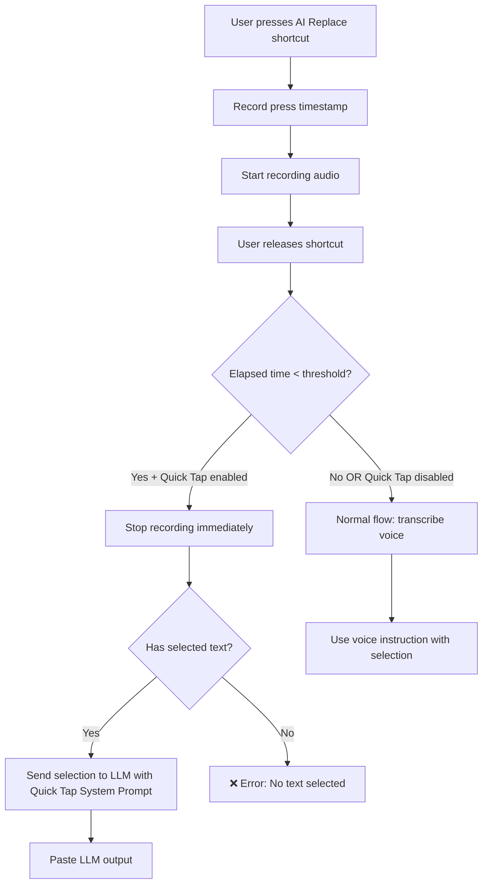

# AI Replace Quick Tap Mode

## Overview

Add a "Quick Tap" mode to AI Replace that allows processing selected text without voice instruction when the shortcut is pressed and released quickly (< threshold ms).

## User Flow



## New Settings

| Setting | Type | Default | Description |
|---------|------|---------|-------------|
| `ai_replace_allow_quick_tap` | `bool` | `true` | Enable/disable quick tap mode |
| `ai_replace_quick_tap_threshold_ms` | `u32` | `500` | Time threshold in milliseconds |
| `ai_replace_quick_tap_system_prompt` | `String` | See below | System prompt for quick tap mode |

### Default Quick Tap System Prompt

```
You are a text improvement engine.
Improve the provided text while preserving its original meaning and intent.
Fix any grammar, spelling, or punctuation errors.
Enhance clarity and readability where possible.
Return ONLY the improved text without any explanations or commentary.
Preserve the original language and formatting unless fixing errors requires changes.
```

## Implementation Details

### 1. Backend State Management

Need to track when the shortcut was pressed to calculate elapsed time on release.

**New managed state in `lib.rs`:**
```rust
pub struct PressTimestamps {
    pub timestamps: HashMap<String, Instant>,
}
pub type ManagedPressTimestamps = Mutex<PressTimestamps>;
```

### 2. Files to Modify

#### `src-tauri/src/settings.rs`
- Add 3 new fields to `AppSettings`
- Add default value functions
- Update `get_default_settings()`

#### `src-tauri/src/lib.rs`
- Add `ManagedPressTimestamps` state initialization
- Export the type

#### `src-tauri/src/actions.rs`
- Modify `AiReplaceSelectionAction::start()` to record timestamp
- Modify `AiReplaceSelectionAction::stop()` to:
  1. Calculate elapsed time
  2. If quick tap detected → skip transcription, use quick tap prompt
  3. Otherwise → normal flow

#### `src-tauri/src/shortcut.rs`
- Add 3 new command functions:
  - `change_ai_replace_allow_quick_tap_setting`
  - `change_ai_replace_quick_tap_threshold_ms_setting`
  - `change_ai_replace_quick_tap_system_prompt_setting`

#### `src/components/settings/ai-replace/AiReplaceSelectionSettings.tsx`
- Add new settings group for "Quick Tap Mode"
- Toggle for enable/disable
- Number input for threshold (with reasonable bounds: 200-2000ms)
- Textarea for system prompt

#### `src/i18n/locales/en/translation.json`
- Add translation keys for new UI elements

### 3. Logic Flow in `AiReplaceSelectionAction::stop()`

```rust
// In stop():
let settings = get_settings(&ah);

// Get press timestamp and calculate elapsed
let elapsed_ms = {
    let timestamps = ah.state::<ManagedPressTimestamps>();
    let mut guard = timestamps.lock().unwrap();
    guard.timestamps
        .remove(&binding_id)
        .map(|start| start.elapsed().as_millis() as u32)
        .unwrap_or(u32::MAX) // Fallback to max if no timestamp (shouldn't happen)
};

let is_quick_tap = settings.ai_replace_allow_quick_tap 
    && elapsed_ms < settings.ai_replace_quick_tap_threshold_ms;

if is_quick_tap {
    // Skip audio processing, go directly to selection capture
    // Use ai_replace_quick_tap_system_prompt instead of voice instruction
    // ... (capture selection and send to LLM)
} else {
    // Normal flow with transcription
    // ... (existing code)
}
```

### 4. Quick Tap LLM Call

For quick tap, the LLM call is simpler:
- System prompt: `ai_replace_quick_tap_system_prompt`
- User message: Just the selected text (or use `ai_replace_user_prompt` with empty instruction)

Create a new helper or modify `ai_replace_with_llm()` to accept an optional override system prompt.

## UI Layout

In `AiReplaceSelectionSettings.tsx`, add a new `SettingsGroup` after the shortcuts section:

```
┌─────────────────────────────────────────────┐
│ Quick Tap Mode                              │
├─────────────────────────────────────────────┤
│ When you press and release the shortcut    │
│ quickly, the selected text is sent to AI   │
│ without recording your voice instruction.  │
├─────────────────────────────────────────────┤
│ Enable Quick Tap         [Toggle: ON]       │
├─────────────────────────────────────────────┤
│ Threshold                [500] ms           │
│ (Time to hold before voice recording)       │
├─────────────────────────────────────────────┤
│ System Prompt                               │
│ ┌─────────────────────────────────────────┐ │
│ │ You are a text improvement engine...    │ │
│ │                                         │ │
│ └─────────────────────────────────────────┘ │
└─────────────────────────────────────────────┘
```

## Edge Cases

1. **No selection + quick tap**: Show error "No text selected for quick tap"
2. **Quick tap disabled**: Normal flow always
3. **Selection too large**: Apply `ai_replace_max_chars` limit
4. **No LLM configured**: Show existing error

## Testing Checklist

- [ ] Quick tap with selection → text improved
- [ ] Quick tap without selection → error message
- [ ] Normal hold (> threshold) → voice instruction works
- [ ] Toggle off → always uses voice
- [ ] Threshold adjustment works correctly
- [ ] Custom system prompt is used
- [ ] Push-to-talk vs toggle mode both work

## Translation Keys

```json
{
  "settings.aiReplace.quickTap.title": "Quick Tap Mode",
  "settings.aiReplace.quickTap.description": "When you press and release the shortcut quickly, the selected text is sent to AI without recording your voice instruction.",
  "settings.aiReplace.quickTap.enableToggle.label": "Enable Quick Tap",
  "settings.aiReplace.quickTap.enableToggle.description": "Allow quick tap to process text without voice",
  "settings.aiReplace.quickTap.threshold.title": "Threshold",
  "settings.aiReplace.quickTap.threshold.description": "Maximum hold time to trigger quick tap (milliseconds)",
  "settings.aiReplace.quickTap.threshold.suffix": "ms",
  "settings.aiReplace.quickTap.systemPrompt.title": "System Prompt",
  "settings.aiReplace.quickTap.systemPrompt.description": "Instructions for AI when processing text without voice"
}
```

## Code Changes Summary

| File | Changes |
|------|---------|
| `src-tauri/src/settings.rs` | +3 fields, +3 default functions |
| `src-tauri/src/lib.rs` | +1 state type, +1 initialization, +3 commands |
| `src-tauri/src/actions.rs` | Modify `start()` and `stop()`, add quick tap logic |
| `src-tauri/src/shortcut.rs` | +3 command functions |
| `src/components/settings/ai-replace/AiReplaceSelectionSettings.tsx` | +1 settings group with 3 controls |
| `src/i18n/locales/en/translation.json` | +8 translation keys |
| `fork-agents.md` | Document new settings |
| `code-notes.md` | Update with new settings |
